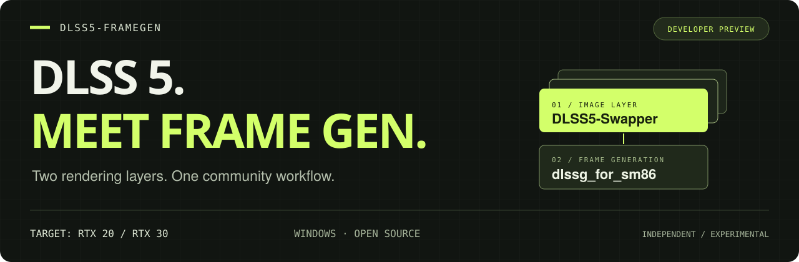
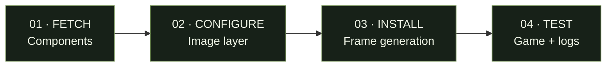

<p align="center">
  
</p>

<p align="center">
  <strong>English</strong> · <a href="README.zh-CN.md">简体中文</a>
</p>

# DLSS 5 + Frame Generation for RTX 20/30

**Explore DLSS 5 and frame generation together, with a shared setup workflow.** DLSS5-FrameGen connects [DLSS5-Swapper](https://github.com/rakanki911/DLSS5-Swapper) and [dlssg_for_sm86](https://github.com/sdli1995/dlssg_for_sm86): download components, configure the frame-generation layer, and inspect the resulting logs.

[](docs/STATUS.md)
[](#will-it-work-with-my-setup)
[](#will-it-work-with-my-setup)
[](LICENSE)

> **Developer preview.** Best suited to contributors and experienced modders using disposable test copies. The file-safety, rollback and checksum issues from the [2026-09-20 review](docs/reviews/2026-09-20-project-review.md) are fixed and pinned by regression tests (the review's repro script now reports all nine behaviors fixed). No verified in-game benchmarks yet. **Read the [current limitations](docs/STATUS.md) before installing.**

<p>
  <a href="../../releases"></a>
  <a href="#get-started"></a>
  <a href="https://github.com/ztwzeroo/DLSS5-FrameGen/issues/new?template=game-test.yml"></a>
</p>

[Compatibility](#will-it-work-with-my-setup) · [FAQ](#frequently-asked-questions) · [Known issues](docs/STATUS.md) · [Contribute](CONTRIBUTING.md) · [Changelog](CHANGELOG.md) · [Dev log](docs/devlog/2026-09-20.md)

*Prebuilt Windows EXE and Linux binaries ship on the [Releases](../../releases) page — or run from source with Python 3.10+. No upstream DLLs are bundled; components are fetched and checksum-verified at install time.*

## Why this project?

Setting up two graphics mods means managing two layers of files, configuration and troubleshooting. This project brings the coordination into one small, open-source CLI.

| You want to… | This toolkit helps you… |
|---|---|
| Try both layers together | Download the upstream components into one local kit. |
| Configure frame generation | Choose a runtime, multiplier ceiling and optimization tier. |
| Understand your installation | Record installed files and inspect backend logs. |
| Help others with the same GPU | Share reproducible game tests using a structured report. |

The image layer is still configured in **DLSS5-Swapper's own interface**. Rendering and frame generation are provided by the upstream projects; this repository provides the workflow around them.

## The workflow at a glance



*Setup workflow only. This diagram is not a gameplay demonstration or performance result.*

## Will it work with my setup?

These are the **target requirements**, not a verified compatibility list.

| Component | Target |
|---|---|
| GPU | NVIDIA RTX 20 series or RTX 30 series |
| OS | Windows 10/11, 64-bit |
| Game | D3D12, with native DLSS Frame Generation support |
| Driver | Follow the upstream requirements; this CLI warns below R580 |
| Python | 3.10 or later |
| Use | Single-player test copies, without anti-cheat |

RTX 40/50, Vulkan games and games without native frame-generation support are outside this project's current target. Other mods may conflict. **Do not use this with anti-cheat or competitive multiplayer games.**

## Get started

Use an independently backed-up or disposable game copy. Uninstall validates its manifest, skips externally modified files and restores pre-existing user configs — but no restore is a substitute for a backup. See the [known issues](docs/STATUS.md#known-issues).

### 1. Get the toolkit

**Easiest (no Python needed):** grab `dlss-combo-<version>-windows-x64.zip` from [Releases](../../releases), extract `dlss-combo.exe`, and use it anywhere below in place of `py -m dlss_combo`:

```powershell
.\dlss-combo.exe fetch
.\dlss-combo.exe install "C:/Games/TestCopy/Binaries/Win64"
```

**From source:** [download the source ZIP](https://github.com/ztwzeroo/DLSS5-FrameGen/archive/refs/heads/main.zip), extract it, and open PowerShell in the extracted folder. Then run:

```powershell
py -m pip install .
py -m dlss_combo fetch
```

Prefer Git? Clone `https://github.com/ztwzeroo/DLSS5-FrameGen.git`, open that folder, and run the same commands. The Python package and CLI retain the original names `dlss_combo` and `dlss-combo`.

### 2. Configure the image layer

Open the downloaded **DLSS5-Swapper portable EXE** in `~/dlss-combo-kit/swapper/`. Use its interface and upstream instructions to configure your **test copy** of the game. If the asset is a ZIP, follow the upstream extraction instructions first.

### 3. Add frame generation

Replace the example path with the folder containing your test game's **actual rendering EXE**:

```powershell
py -m dlss_combo install "C:/Games/TestCopy/Binaries/Win64" --mfg 4x
```

`4x` is a ceiling, not a promise of four times the measured FPS. The game and runtime determine what is supported. Start by checking your base frame rate before increasing the multiplier.

### 4. Play, inspect, share

Enable frame generation in the game's graphics settings if available. After a test session:

```powershell
py -m dlss_combo doctor "C:/Games/TestCopy/Binaries/Win64"
```

A successful file installation or detected ReShade folder does **not** prove either rendering layer is active. Diagnostics have known limitations; [report your observed result](https://github.com/ztwzeroo/DLSS5-FrameGen/issues/new?template=game-test.yml), including failures.

<details>
<summary><strong>More commands and tuning options</strong></summary>

Use `py -m dlss_combo --help` or `py -m dlss_combo install --help` for the full CLI.

| Option / command | What it does |
|---|---|
| `fetch --runtime 310.9` | Download the 310.9 runtime kit; 310.1 is also available. |
| `fetch --kit-dir PATH` | Use a custom component cache. Use the same path with `install`. |
| `fetch --refresh` | Redownload components. Per-file atomic staging; other components' metadata is preserved. |
| `install DIR --tier 0` | Choose the upstream stock-numerics tier; tiers 0–3 are exposed. |
| `install DIR --mfg 2x` | Set a lower frame-generation ceiling. 3x, 4x and 6x are also exposed. |
| `install DIR --arch sm86` | Override the GPU-architecture check; driver checks still run. |
| `install DIR --proxy winmm.dll` | Pin a specific proxy DLL name (default order follows the upstream tool-class proxies first). |
| `install DIR --launch-swapper` | Launch the downloaded DLSS5-Swapper portable after installing (checksum-verified). |
| `uninstall DIR` | Remove managed files. Read the file-safety and restoration issues first. |

6X requires a compatible 310.9 build **and** game. Setting 6X with 310.1 does not make that runtime support it. Some optimization tiers are also runtime-dependent. Consult the [upstream INI](https://github.com/sdli1995/dlssg_for_sm86/blob/main/dlssg_sm86.ini) for meanings and constraints.

</details>

## Linux / Steam Proton

Windows games running through Proton are still Windows processes, so the frame-generation layer is expected to apply the same way — **not yet verified end-to-end by this project on Linux**. Grab `dlss-combo-<version>-linux-x64.zip`, then point the CLI at the folder containing the game's **rendering EXE**. The reliable way to find it is Steam → *Manage* → **Browse local files** (Proton installs often live under the prefix's `drive_c`, but the layout is not guaranteed — the Browse-local-files location is the reliable reference):

```bash
chmod +x dlss-combo
./dlss-combo install "/path/to/Game/Binaries/Win64"
```

Some setups add Steam launch options so Wine loads the proxy and Proton exposes
NVAPI/CUDA:

```
WINEDLLOVERRIDES="version=n,b" PROTON_ENABLE_NVAPI=1 PROTON_NVIDIA_NVCUDA=1 %command%
```

> These options are community convention (the route [DLSS Unlocked](https://github.com/ShyVortex/DLSS-Unlocked) documents), **not verified with this toolkit** — check your Proton version's behavior against [Valve's config notes](https://github.com/ValveSoftware/Proton#runtime-config-options) before relying on them. Substitute the actual proxy name (`winmm`/`dbghelp`/…) if it is not `version.dll`.

- The image layer (DLSS5-Swapper) is a Windows GUI app; running it via Wine is upstream-experimental — on Linux, validate the frame-generation layer first.
- **Linux binaries require glibc >= 2.35** — the real floor is measured per build by extracting the embedded ELF libraries from the PyInstaller archive (an outer-file string scan under-reports it; the current build's floor is in each zip's `build-info.txt`). Other distros are unverified; to target older systems, run from source.

## What has actually been tested?

| Evidence | Current state |
|---|---|
| Offline Python tests | 107 passing; CI runs the suite on Windows/Linux/macOS on every push |
| Review regression | The 2026-09-20 repro script reports all nine fixed behaviors |
| Release binaries | Windows EXE + Linux x64 built by GitHub Actions from each tagged commit |
| Windows game sessions | Not yet validated by this project |
| FPS, latency and image quality | No verified measurements published |
| File safety | Review issues fixed in code with regression coverage; in-game safety still unverified |

We welcome negative results as well as successful runs. A useful comparison uses the **same scene and settings** for the original game, image layer only, frame generation only, and both layers together. Do not infer real FPS gains from the configured multiplier.

**[Submit a game test →](https://github.com/ztwzeroo/DLSS5-FrameGen/issues/new?template=game-test.yml)** · [Report a bug](https://github.com/ztwzeroo/DLSS5-FrameGen/issues/new?template=bug-report.yml) · [Contribute code](CONTRIBUTING.md)

## Frequently asked questions

<details>
<summary><strong>Is there a one-click Windows EXE?</strong></summary>

Yes — [Releases](../../releases) carries a prebuilt `dlss-combo.exe` (Windows x64) and a Linux x64 binary, built by GitHub Actions from the tagged commit. They are unsigned, so SmartScreen may show a reputation prompt. The upstream Swapper portable EXE is a separate application.

</details>

<details>
<summary><strong>Does this replace DLSS5-Swapper or implement DLSS 5?</strong></summary>

No. DLSS5-Swapper manages the image-layer routes, and dlssg_for_sm86 provides frame generation. This toolkit coordinates their setup and diagnostics. It is an independent community project.

</details>

<details>
<summary><strong>Will it double my FPS or work in every game?</strong></summary>

There are no verified performance results for this combined toolkit yet. GPU, game, runtime, base frame rate and other mods all matter. Configured multipliers are not measured FPS gains.

</details>

<details>
<summary><strong>Why are some command-line messages in Chinese?</strong></summary>

The English documentation covers setup, but the CLI currently includes Chinese messages. English CLI output is on the roadmap. Include the original output when reporting a problem.

</details>

<details>
<summary><strong>Where are the gameplay screenshots and benchmarks?</strong></summary>

We will add them when reproducible Windows/NVIDIA tests are available. The banner and workflow diagram are explanatory graphics, not evidence of in-game results. Real game reports, including unsuccessful tests, are welcome.

</details>

## Where we're headed

- [ ] Protect externally modified files and restore original configurations.
- [ ] Make checksum validation and interrupted-install recovery reliable.
- [ ] Add installation previews and accurate per-session diagnostics.
- [ ] Add English CLI messages and clearer error guidance.
- [ ] Validate Windows behavior and publish reproducible RTX 20/30 game results.

See the [English status and known issues](docs/STATUS.md), [detailed audit (Chinese)](docs/reviews/2026-09-20-project-review.md), and [contributor guide](CONTRIBUTING.md).

## Built on the work of

**[DLSS5-Swapper](https://github.com/rakanki911/DLSS5-Swapper)** — image-layer installation routes and component management.
**[dlssg_for_sm86](https://github.com/sdli1995/dlssg_for_sm86)** — the DLSS-G proxy and frame-generation implementation.

Please support the upstream maintainers. This repository does not modify, rebuild or redistribute their binaries; `fetch` downloads components from upstream. Downloads currently have the validation limitations described above.

[MIT licensed](LICENSE). Independent community project, not affiliated with or endorsed by NVIDIA or either upstream project. DLSS and RTX are NVIDIA trademarks.
